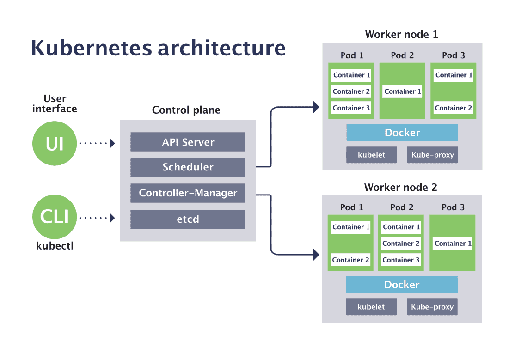

# EXAM

1. KCNA - Entry Level
2. CKAD - Basic (Easy)
> Pre Linux Basic Fundamental
3. CKA - Intermediate
4. CKS - Security

---
# Windows 11 WSL setup

1. Clone this repo `https://github.com/sandervanvugt/ckad`

git clone git@github.com:sandervanvugt/ckad.git

2. ```sh ./minikube-docker-setup.sh ```

3. Minikube auto completion

- minikube completion -h | less
- source <(minikube completion bash)

----
## Running Simple


* if docker is not running you will get following , start it using # start services using sysvinit

    sudo systemctl start docker
    System has not been booted with systemd as init system (PID 1). Can't operate.
    Failed to connect to bus: Host is down


#### Start docker in WSL
```sh
 sudo service docker start
```

----

### 101 - Getting Started with Minikube

```sh
 minikube start --vm-driver=docker --cni=calico
 ```

 * `--cni=calico` is networking plugin

```sh
  minikube status
```

* minikube log in to host
```sh
minikube ssh
```


```
 kubectl get all
```

```sh
 docker ps
 ```

-----------
### minikube dashboard

* GUI based interactive app to use minikube
```sh
minikube dashboard
```

*NOTE* Do not use GUI instead use `kubectl`

--------------------
## Kubernetes

* Release every 4 months
* Kubernetes is a portable, extensible, open source platform for managing containerized workloads and services, that facilitates both declarative configuration and automation.

* The name Kubernetes originates from Greek, meaning helmsman or pilot. K8s as an abbreviation results from counting the eight letters between the "K" and the "s".

* [K8s Components](https://www.devopsschool.com/blog/kubernetes-tutorials-list-of-components-of-kubernetes/)



----
#### Overview of Kube config file
- Kube cofig allows us to run everything in K8s cluster

`cat ~/.kube/config`
OR
`kubectl config view`

- Config file consists of
> users - details for login to cluster. i.e client-certificate and client-key
> clusters - details of the cluster
> contexts - Current working env having details such as namespace,

- Setting Context

`kubectl config set-context minikube --namespace=kube-system`

OR

`kubectl config set-context --current --namespace=default`


### Kubectl

```ssh
kubectl -h | less
 ```
-  kubectl completion -h | less

- Load the kubectl completion code for bash into the current shell
 ``` source <(kubectl completion bash)```

----
### Kubernetes Create Deployment

```bash
kubectl create deploy firtnginx --image=nginx --replicas=3
```

* test
```kubectl get all ```
---

### Understanding Containerfile

- Containerfile (Dockerfile) used to build the container images

- Alternative to docker to [podman](https://podman-desktop.io/)

- Writing efficient docker files

- Build, Save Docker file

```cd ckad/
ls
cd dockerfile/
ls
cat Dockerfile
cat sander.repo
docker build -t centmap .
docker images
docker ps
docker save centmap -o centmap.tar
```
#### 1. POD

- It is basic unit in K8s & represents a set of containers that share common Resources such as an IP address and persistent storage volume

#### 2. Deployments

- It is a default entity that is rolled out with k8s

#### 3. Services

- Services make deployments accessible from outside by providing a single IP/port combination.Services by default provide access to pod in round Robin fashion using a load balancer.

#### 4. kubectl

- It is under the hood uses curl to send a request to Kubernetes API.It has many sub commands, making it possible to manage all aspects of k8s.

- You use tube kubectl command --help documentation, including examples.

- Use  `source<(kubectl completion bash)` to make working with kubectl easier

- Use ` kubectl explain pod`
---

#### Pod vs Deployment

- Standalone pods are not rescheduled in case of events such as node failure. However, if pod is deployed using deployment then pod is recreated in case of accidental termination.

---
## YAML Basics

- YAML is human-readable data-serializable language
- Uses indentation to identify the relations

- K8s yaml
> apiVersion
> kind
> metadata
> spec

- Use `kubectl explain` to get more information
---

### Generating Yaml

- To generate yaml, `--dry-run=client -o yaml >my.yaml` as an argument to the kubectl run and kubectl create commands
> eg.  kubectl run nginxx --image=nginx --dry-run=client -o yaml>my.yaml
> kubectl run nginxx --image=nginx --dry-run=client -o yaml

- Check my.yaml file

```
apiVersion: v1
kind: Pod
metadata:
  creationTimestamp: null
  labels:
    run: nginxx
  name: nginxx
spec:
  containers:
  - image: nginx
    name: nginxx
    resources: {}
  dnsPolicy: ClusterFirst
  restartPolicy: Always
  activeDeadlineSeconds: 30
status: {}
```

- Use explain command and spec to `activeDeadlineSeconds`
> kubectl explain pod.spec

- Yaml file will be like

```
apiVersion: v1
kind: Pod
metadata:
  creationTimestamp: null
  labels:
    run: nginxx
  name: nginxx
spec:
  containers:
  - image: nginx
    name: nginxx
    resources: {}
  dnsPolicy: ClusterFirst
  restartPolicy: Always
  activeDeadlineSeconds: 25
status: {}
```
### Kubectl create vs apply

- Create --> Used to create a resource from YAML
- Apply (update existing once Or create new if not present ) --> create a resource if does not exist yet and modify it if it already exists & has been created with `kubectl apply` earlier

---

## Exercise

- Create a YAML file to run the nginx container.Find the Appropriate option to set The priority of container. Hint use `kubectl explain`, and next run the yaml file to create a resource

### Solution
- run ` kubectl run nginxx-exe-1 --image=nginx --dry-run=client -o yaml > exe-1.yaml`
- `cat  exe-1.yaml` and priority value in spec

```
apiVersion: v1
kind: Pod
metadata:
  creationTimestamp: null
  labels:
    run: nginxx-exe-1
  name: nginxx-exe-1
spec:
  containers:
  - image: nginx
    name: nginxx-exe-1
    resources: {}
  dnsPolicy: ClusterFirst
  restartPolicy: Always
  priority: 0
status: {}
```

- create a pod using `kubectl apply -f exe-1.yaml`

### Learning --> Priority Class

----

### Multi-Container Pod

#### Use cases for multiple container
- Sidecar container - it enhance the primary container, for logging, service mesh etc
- Ambassador Container - a container that represent the primary container to the outside world, such as proxy
- Adapter container - Used to adopt the traffic or data pattern to match the traffic or data pattern in other application cluster

- **NOTE:** Sidecar containers etc., are not defined using specific pod properties from a kubernetes  API resource & it's multi-container pod

##### Sidecar container in Depth

- A sidecar container is providing additional functionality to the main primary container,  where it makes no sense running this functionality in a separate pod.
- Think of logging, monitoring, and syncing use cases.
- The essence is that main container and the sidecar Container have access to shared resources (eg. shared volume)to Exchange information.
- Istio service mesh injects sidecar Container in pods to enable Traffic management.

###### Demo for Sidecar container
- Use [sidecar container example](../sidecar.yaml)
- Run ` kubectl apply -f sidecar.yaml`
- Get pods and run side card container
`kubectl exec -it sidecar-pod -c sidecar -- /bin/bash`
- Inside container run ` yum install -y curl`
- Run ` curl http://localhost/date.txt`

##### Init Container

- An init container, is an additional container in a pod that completes a task before regular container is started. Task can be downloading dependencies or configuring essential things.

- The regular container will only be started once the init container has been started.

- If the init container has not run to completion state, the main container is not started.

- check [init-example1.yaml](../init-example1.yaml) and  [init-example2.yaml](../init-example2.yaml)

```
kubectl create -f init-example1.yaml
kubectl get pods
kubectl create -f init-example2.yaml
kubectl get pods
```

----
### Namespaces

- Namespaces can be used to apply strict separation between resources.
- `kube-system` namespace is used for k8s resources
- `default` is used for user resources
- operators are typically create their own namespaces
- Use dedicated namespace while deploying applications

- Namespaces can be used to apply different security-related settings such as RBAC (Role-Based Access Control), network policy, quota,

- use `kubectl describe ns`

#### using namespaces

- Create namespaces --> `kubectl create namespace mynamespace`
- Using namespace --> `kubectl COMMAND -n mynamespace`
- Get resources --> `kubectl get COMMAND -all-namespaces`
- Set the current namespace --> `kubectl config set-context --current --namespace=my-namespace`
---

## Understanding Security Context

- SecurityContext defines a privilege And access control settings for a pod Or container.And includes following.

1. Discretionary access control which is about permission used to access object.
2. Security enhanced Linux, layer security levels can be applied.
3. Running as privileged or unprivileged user.
4. Using Linux capabilities.
5. AppArmor which is alternative to SELinux
6. AllowPrivilegeEscalation, which controls if a process Can contain more privilege than its parent process

- Use `kubectl explain pod.spec.securityContext | less`

### Demo SecurityContext

- use [securitycontextdemo2](../securitycontextdemo2.yaml)

```
kubectl apply -f securitycontextdemo2.yaml
kubectl exec security-context-demo -it -- sh
```

- use [securitycontextdemo.yaml](../securitycontextdemo.yaml)

----

## Managing Jobs

- Pods are normally created to run forever. And Pod has a restart policy that is by default set to "restart". That means if pod stops then it will always restart
- If we need to create a Pod that runs up to the completion we can use **Job**.
- Jobs are not automatically removed after completion. In order to clean those, `spec.ttlSecondsAfterFinished`.

### Job type

- Depending on `completions` and `parallelism`, there are 3 different types of jobs

1. Non parallel jobs - one pod started unless the pod fails
- compeletions=1
- parallelism=1

2. Parallel jobs with fixed completion count - the job is complete after successfully running as many as specified in jobs.spec.completions

3. Parallel jobs with a work queue - multiple jobs are started, when one completes successfully , the job is complete.

- kubectl  create job mynewjob --image=busybox --dry-run=client -o yaml -- sleep 5 > mynewjob.yaml
- vi mynewjob.yaml

